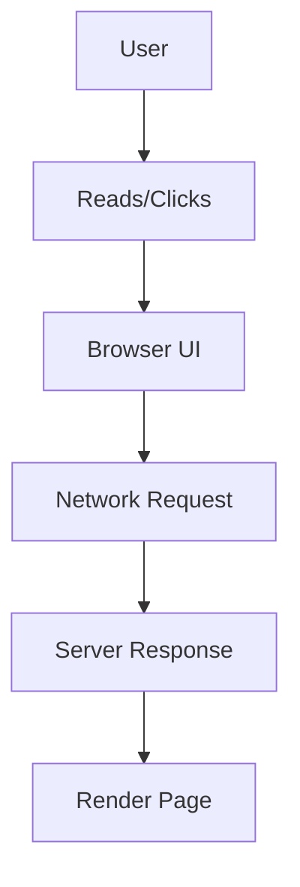

# Wiki_HIEN-Documentation.md

## [00] Universal Includes (Mandatory Order)
1) require_once `Workflows/ACC/_Common/Workflow_Universal.md`
2) require_once `Workflows/ACC/_Common/Workflow_Singular.md`

> Note: Hum yahan `Workflow_Singular-Documentation.md` intentionally include nahi kar rahe.
> Reason: us common file me DocsRoot locked sirf WebOS/WebApps/WebBrand/WebSDK hai.
> Aliens Wiki articles ka output `/Aliens/Wiki/...` ya `/Aliens/Docs/Wiki/...` hai, is liye yeh workflow apna doc-output contract khud define karta hai.

---

## [01] Purpose (Hinglish)
Is workflow ka kaam: ek single topic par **Wikipedia-style ultra detailed** markdown article generate karna.
Audience: bilkul beginner students (jinhe computer ka basic bhi nahi).

---

## [02] Inputs Rules (Strict)
### Targets
- Single topic name only.
- Multiple targets (comma) => `ACC_ERR_ARGS_INVALID`.

### Title vs Slug (important)
- `TopicTitle` MUST come from `Targets`.
- `TopicSlug` MUST be derived from `Targets` **unless** CSV mode provided an override:
  - If `Description` contains `UTag: <value>` (case-insensitive key), then use `<value>` as `TopicSlug`.

### Description
- Required.
- Description ko as constraints treat karo.

---

## [03] Planning Dependency (Mandatory)
- Planning file read karo:
  - `/Aliens/.Alien/{Developer_Username}/Planning/Wiki/HIEN/{TopicSlug}.plan.md`

If missing:
- Fail fast with `ACC_ERR_PLANNING_GENERATION_FAILED`.

---

## [04] Output Path Policy (Deterministic + Safe)
Preferred output:
- `/Aliens/Wiki/HIEN/{TopicSlug}.md`

Fallback output (jab manifest AllowedRoots me `/Aliens/Wiki` allowed nahi ho):
- `/Aliens/Docs/Wiki/HIEN/{TopicSlug}.md`

Hard rule:
- Output path MUST be within manifest `Permissions.AllowedRoots`.
- Agar dono roots allowed nahi => fail with `ACC_ERR_IO_WRITE_FAILED` (action: fix manifest AllowedRoots).

---

## [05] Wikipedia-Style Markdown Format (Required)
Article MUST look and feel like Wikipedia, but in Hinglish Roman.

### 5.1 Top metadata header (required)
Markdown file ke bilkul top par yeh YAML header MUST ho:
```yaml
---
Wiki: Aliens Wiki
Language: HIEN
Topic: <TopicTitle>
Slug: <TopicSlug>
Audience: "Absolute beginner to enterprise-grade software engineer"
LastUpdated: 2026-02-27
---
```

### 5.2 Title + Lead
- `# <TopicTitle>`
- 1–3 paragraphs ka **lead** (simple definition + why it matters)

### 5.3 Infobox (table)
Lead ke baad ek infobox table MUST include karo.
Example structure (topic ke hisaab se fields adjust):

| Field | Value |
|---|---|
| Type | ... |
| First released | Not confirmed |
| Primary use | ... |
| Key concepts | ... |
| Common examples | ... |

### 5.4 Table of Contents
- Markdown TOC (simple bullet list) add karo.

### 5.5 Sections (Wikipedia-like)
Minimum recommended sections (topic ke hisaab se adapt karo):
- Overview
- History / Evolution
- How it works (beginner explanation)
- Key components (with table)
- Common use-cases
- Security & privacy (beginner + serious)
- Performance considerations
- Common mistakes (beginner)
- Comparison table (e.g., types/alternatives)
- See also (internal wiki links)
- References (only if you can name reliable sources without guessing)
- External links (Wikimedia / official docs; if not confirmable, omit instead of guessing)

---

## [06] Required Media + Diagrams
### 6.1 Images
- At least 2 images MUST be included.
- Allowed sources:
  - Wikimedia Commons (preferred)
  - Aliens-owned assets (if provided in repo)

No guessing rule:
- Agar exact Wikimedia file URL confirm nahi, to article me **image placeholder** mat dalo.
- Instead add a dedicated section: `## Media requests (needs online selection)` with:
  - search keywords
  - desired image type
  - intended placement section

### 6.2 Mermaid Flowchart
At least 1 Mermaid diagram MUST be included.
Example:


### 6.3 Tables
- At least 2 tables MUST be present (infobox counts as 1).

---

## [07] Honesty + Beginner Contract
- No fake numbers/dates.
- If unsure: write `Not confirmed`.
- Har technical word ka simple meaning do.
- Hindi script bilkul avoid.

---

## [08] Internal Linking Rules
- Internal wiki links as relative markdown:
  - `[HTTP](HTTP.md)`
  - `[URL](URL.md)`

Slug rule:
- Link target filenames MUST match `{TopicSlug}.md` policy.

---

## [09] Done Definition (Documentation)
Run successful tabhi:
- Article file exists and non-empty
- Hinglish Roman only
- Infobox + TOC + multiple headings present
- At least 1 Mermaid diagram present
- Tables present
- No invented citations/links
