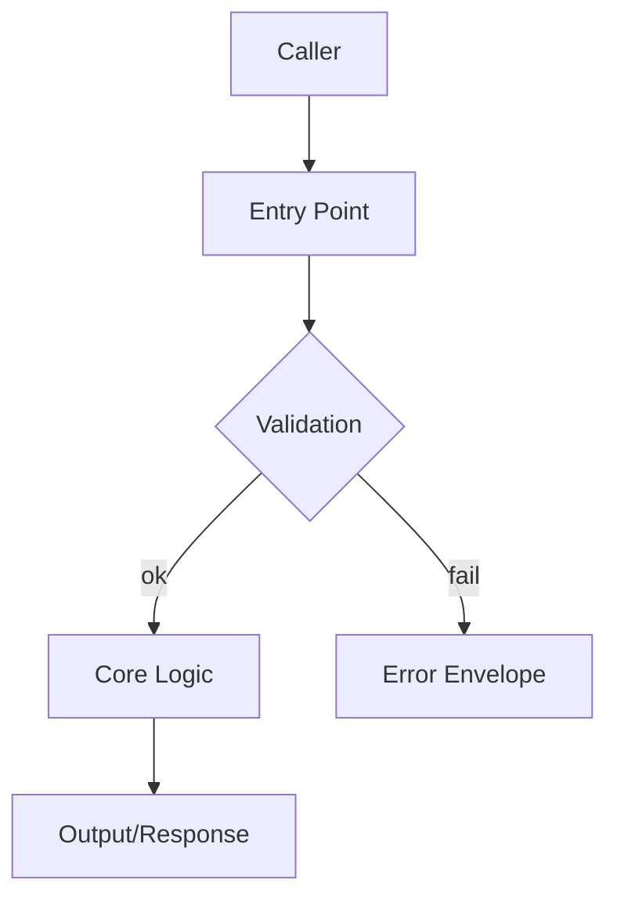

# Workflow_Singular-Documentation.md
**Description (Hinglish):**  
Yeh file *workflow nahi hai*. Yeh **Singular-Documentation** type workflows ka common rule-engine hai.  
Har woh workflow jo documentation generate karega (e.g., `WebSDK_Module_API-Documentation`) usko is file ko `require_once` karna mandatory hai.

> **Singular-Documentation ka meaning:**  
> Aisa workflow jo **sirf documentation generate karta hai**, aur kisi child workflow ko call nahi karta (Singular rule).

---

## [01] Hard Rule: Common vs Unique (Very Important)
**Is file me sirf woh rules hon jo har Documentation workflow ko chahiye.**

Allowed in this common file:
- Documentation content contract (structure, sections, quality)
- Discovery contract (kaunsi info kahan se uthani hai)
- Save rules (docs root + naming + paths)
- Approval / safety policy alignment
- Audit + run-record expectations
- Error model (missing target => error in update workflows)

NOT allowed in this common file:
- Kisi ek specific module/app/brand ki unique documentation steps
- Kisi specific workflow ka custom template, wording, ya unique mapping
- Hardcoded paths jo sirf ek family ko apply hon

**Reason:**  
Is file me change ka impact 10,000+ docs workflows par ek sath padega.

---

## [02] Mandatory Requires (Documentation Workflows)
Documentation workflows MUST include these common refs (direct or via this file):

- `Workflow_Singular.md` (base singular rules)
- `WebOS_Engines.md` (engine capabilities reference)
- `WebOS_System.md` (system functions reference)
- `WebSDK.md` (sdk modules/methods reference)
- ACC refs: Targets, Paths, Output, Safety, UI.Premium
- Developer manifest: `/Aliens/manifest.json`

**Purpose:**  
Docs generation ke time agent ko ecosystem ka “allowed / preferred” pattern clear rahe.

---

## [03] Inputs Contract (Mandatory)
Every Singular-Documentation workflow MUST accept:

- `WorkflowId` (string)
- `Targets` (string) — single target OR comma list allowed (but singular workflow generally receives single target from Plural)
- `Description` (string) — user/custom requirements

**Important:**  
Plural workflow agar list pass kare to singular-doc workflow MUST split + loop internally OR fail with clear error.  
Recommended policy: singular-doc expects **one target**; if multiple => auto-split and treat as multiple doc items.

Targets grammar details: `Workflows/ACC/_Refs/ACC.Targets.md`

---

## [04] Context Resolution Contract (Mandatory)
Documentation workflow MUST resolve context using developer manifest:

- Mode: employee/assistant
- ApprovalMode: auto/manual
- DefaultVersion: latest (fallback PHP.26.00.00)
- DefaultTheme: _Basic
- Paths root: /Aliens, /Aliens/WebOS, /Aliens/WebApp, /Aliens/WebBrand, /Aliens/WebSDK, /Aliens/Docs

If context cannot be resolved:
- Return an actionable error (do not guess silently)
- Save failure note in RunRecord (if run system exists)

---

## [05] Discovery Contract (What to read / inspect)
Documentation ka quality “real code” se aati hai. Documentation workflow MUST attempt discovery in this order:

1) **Target Resolution**
   - Identify Parent + Child (e.g., `User/UserNew`, `Exchange/Balance`, `WebOS.Cache`)
   - Determine Domain + Type using workflow id family (e.g., WebSDK_Module_API vs WebApp_Component)
   - If domain/type cannot be inferred: require explicit hints in the workflow YAML header of the individual workflow
     (e.g., `DocDomain: WebSDK`, `DocType: API`)

2) **Locate Source Files**
   - Use `ACC.Paths.md` mapping to locate likely folders
   - If file missing:
     - For Update workflows => error
     - For New workflows => documentation may still be generated as “spec-first”, but MUST label clearly as spec (not implemented yet)

3) **Read Related Structure**
   When applicable, documentation workflow should look for:
   - Related `sql/index.sql` or table structure reference
   - Related module/app class (index.php) or engine file
   - Existing docs or changelog references (if present)
   - Any example files provided by the individual workflow (only if the individual workflow declares them)

4) **Collect Runtime/Policy Rules**
   - Safety rules (no-delete, approval)
   - Premium UI checklist (only relevant to UI artifacts; otherwise ignore)

**Note:**  
Discovery is “best effort”, but output MUST remain consistent and honest: do not invent facts if not found.

---

## [06] Documentation Content Contract (Minimum Sections)
Generated documentation MUST be structured, enterprise-grade, and consistent.

This contract is the SSOT for documentation quality.
Individual documentation workflows may add domain-specific additions, but MUST NOT weaken or shorten this contract.

### [06.A] Language + Audience Contract (Non-Negotiable)
- Audience beginner hai: language 8th-10th class clarity.
- Documentation MUST be **Hinglish (Roman Hindi)**.
  - Hindi script (Devanagari) bilkul allowed nahi.
  - English sirf technical terms ke liye allowed hai, aur har important term ko simple Hinglish me explain karna mandatory.
- If a workflow previously forced “English-only docs”, that is now overridden by this SSOT.

### [06.B] Length + Depth Contract (Non-Negotiable)
- Documentation “short” nahi honi chahiye.
- Target depth: **3000–8000+ words** (or as needed for full clarity).
- Har major section me practical examples / checklists mandatory.
- Output MUST be beginner-friendly (no unexplained jargon).

### [06.C] Honesty Contract (No Guessing)
- Agar koi info code/repo discovery me directly available nahi hai:
  - **Assumption** clearly label karo.
  - **TODO (Team)** list me capture karo.
  - Fake details invent karna forbidden.

### [06.D] Mandatory Document Structure (Enterprise Prompt SSOT)
Generated documentation MUST contain these sections, in this order:
1) Title Block
2) Executive Summary (Beginner-friendly)
3) Quick Start (10-minute setup)
4) Glossary (Super important)
5) When to Use / When NOT to Use
6) Architecture Overview
7) File & Folder Placement
8) Public API / How to Call
9) Configuration
10) Integration With WebOS Ecosystem (DEEP)
11) Security Model (Beginner but serious)
12) Performance & Scalability
13) Observability (Logs, Metrics, Debugging)
14) Testing Guide (Test-readiness)
15) Common Mistakes (Real beginner issues)
16) FAQ (Minimum 15 Q/A)
17) Change Log / Versioning Notes
18) Extension & Future Hooks
19) Appendix

Notes:
- Mermaid diagrams allowed (keep readable).
- Code examples minimal but practical; fenced code blocks MUST include language tag (php/js/json/yaml/bash).

#### [06.D.0] Mandatory Top Metadata Header (Required)
Har doc file ke bilkul top par (first thing) yeh metadata header MUST exist.

**Output format (exact structure; values fill karo):**
```yaml
---
Engine: <EngineName OR N/A>
Language: <PHP|JS|TS|SQL|Other>
Version: <e.g. PHP.26.00.00>
Source: <relative or absolute repo path(s) used>
Author: <AlienCyborg>
LastUpdated: <YYYY-MM-DD>
---
```

Rules:
- `Engine` docs ke liye engine name, otherwise `N/A`.
- `Source` me minimum 1 source path MUST ho (agar discovery me file nahi mila, to write: `Source: Not found in repo during discovery`).
- `LastUpdated` real run date ho.

#### [06.D.1] Title Block (Required)
Title Block section me yeh cheezen MUST cover hon:
- Doc Title (clear)
- One-line purpose (beginner language)
- Author (same as top metadata header)
- Author URI / Website (for traceability; MUST be clickable and include `https://`)
- Scope (what is included/excluded)
- Ownership (module/app/engine)
- Compatibility/Version note (same as header)
- Links: Source paths + output doc path

#### [06.D.2] Glossary Depth Rule (Non-Negotiable)
Glossary section me **short 1-line definitions forbidden**.

Minimum per glossary term:
- Meaning (simple Hinglish)
- Why it matters (practical)
- Example (small, safe example)

Guideline:
- Per term ~50–120 words target (as needed)
- Medium/large docs me 15+ terms target
- Unknown terms ko bhi explain karo; agar repo me not found, then label: `Not found in repo during discovery`.

#### [06.D.3] Flowcharts Rule (Use as much as possible)
Flowcharts (Mermaid) ko aggressively use karo:
- Architecture Overview me minimum 1 Mermaid flowchart/diagram recommended
- Integration With WebOS Ecosystem me minimum 1 flowchart recommended
- Agar process/document flow exist karta hai, to flowchart MUST be present

Mermaid example (readable):


### [06.E] Traceability (Mandatory)
Documentation MUST include a dedicated traceability block (can be inside the Appendix if needed):
- Source code files read (exact paths)
- Related referenced files used (exact paths)
- Planning artifact path(s) used (if any)
- Final code artifact path(s) documented
- Feature coverage list (what is implemented vs deferred)
- What is confirmed vs assumed

### [06.F] Quality Checklist (Final Gate)
Before writing the final doc, workflow MUST verify:
- Hinglish only (Roman), no Hindi script
- All 19 sections present
- Includes Quick Start + Glossary + Common Mistakes + FAQ
- Top metadata header present (Section [06.D.0])
- Glossary terms are detailed (Section [06.D.2])
- Flowcharts included where applicable (Section [06.D.3])
- Security + performance + testing + observability guidance included
- Assumptions clearly labeled; TODO list present if needed
- No unverified claims

**Rule:** Docs must not claim features that were not found in code discovery.

### [06.G] Additional Quality Constraints
- Use clear headings and bullet points.
- Avoid Hindi script; Hinglish allowed (Romanized).
- If something is unknown, write it as “Not found in repo during discovery”.
- Include exact paths (from ACC.Paths) wherever possible.
- If UI related, include “Premium UI checklist alignment” summary.

---

## [07] Save Location Contract (Docs Root Locked)
Docs MUST be saved under locked roots:

- WebOS docs: `/Aliens/Docs/WebOS/`
- WebApps docs: `/Aliens/Docs/WebApps/`
- WebBrand docs: `/Aliens/Docs/WebBrand/`
- WebSDK docs: `/Aliens/Docs/WebSDK/`

### Path strategy (generic)
Individual documentation workflows MUST provide one of these:
- `DocOutputRelPath` (recommended) OR
- `DocResolverRule` (a deterministic mapping rule)

Examples (conceptual):
- WebSDK Module API: `WebSDK/Module/{Module}/api/{Api}.md`
- WebApp Component: `WebApps/{App}/component/{Component}.md`
- WebBrand Layout: `WebBrand/{Brand}/layout/{AppPrefix}.{Layout}.md`
- WebOS Engine: `WebOS/Engine/{EngineName}.md`

**Important:**  
Yeh examples “illustrative” hain. Exact mapping individual workflow define karega, but it MUST land inside correct DocsRoot.

---

## [08] Overwrite / Update Rules
- Docs generation is allowed to **create or update** doc files.
- No deletion allowed.
- If doc exists:
  - Update with new sections / diffs (keep changelog updated)
- If doc missing:
  - Create new doc file

If individual workflow is `_Update`:
- Source artifact missing => error (do not create “fake update” docs)

---

## [09] Approval Policy (Aligned with Manifest)
Docs generation usually safe hota hai, but approvals still apply when documentation implies or triggers:

- prod code modifications (should not happen in docs workflow, but if requested)
- database touch (should not happen in docs workflow)
- mass edits (large scale docs rewrite) if your manifest requires manual approval

If `ApprovalMode=manual` and action flagged:
- Create approval request in:
  - `/Aliens/.Alien/{Developer}/Approvals/{ApprovalId}.md`
- Stop and wait for approval (as per runtime rules)

---

## [10] Logging + Audit Contract
Documentation workflow MUST output:
- A brief run summary (success/partial/fail)
- List of doc files created/updated
- List of discovery sources used (paths inspected)

Recommended run-record folder:
- `/Aliens/.Alien/{Developer}/Runs/{RunId}/Items/{RunItemId}/`

If run system not active, still write a minimal summary line into a developer-scoped report file (optional).

---

## [11] Failure Strategy (Documentation)
Default safe policy:
- If discovery fails => generate “spec-first” doc only if NOT an Update workflow
- If cannot resolve DocsRoot => fail (never save to random location)
- If cannot determine domain/type => fail unless individual workflow provides explicit hints

---

## [12] Change Control
Because this file affects 10,000+ workflows, any change MUST:
- Be backward compatible where possible
- Be documented in a changelog section
- Add migration note if behavior changes

### Changelog
- 26.00.00 (2025-12-24): Initial Common Rules for Singular Documentation Workflows
- 26.01.00 (2026-01-29): Add mandatory metadata header, glossary depth, and stronger flowchart guidance
